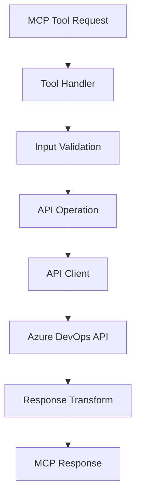
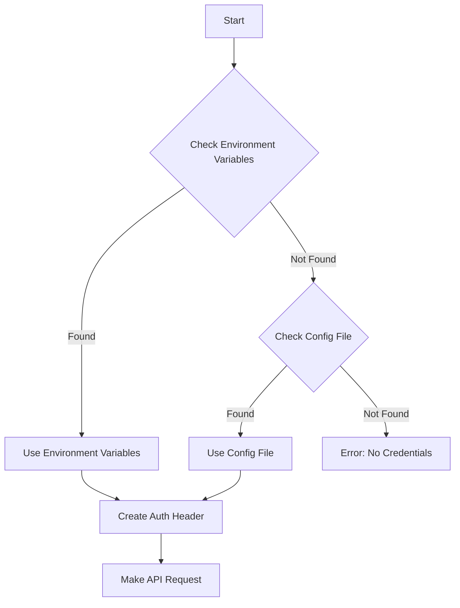

# Azure DevOps MCP Architecture

This document outlines the architecture of the Azure DevOps MCP server, designed to align with Azure DevOps's API structure and resource hierarchy.

## Directory Structure

```mermaid
graph TD
    A[src/] --> B[entities/]
    A --> C[api/]
    A --> D[tools/]
    
    B --> B1[base/]
    B --> B2[project/]
    B --> B3[workitem/]
    B --> B4[repository/]
    
    B1 --> B1_1[base.entity.ts]
    B1 --> B1_2[base.types.ts]
    
    B2 --> B2_1[project.entity.ts]
    B2 --> B2_2[team.entity.ts]
    
    B3 --> B3_1[workitem.entity.ts]
    B3 --> B3_2[workitem.types.ts]
    
    B4 --> B4_1[repository.entity.ts]
    B4 --> B4_2[pullrequest.entity.ts]
    B4 --> B4_3[branch.entity.ts]
    
    C --> C1[client/]
    C --> C2[operations/]
    
    C1 --> C1_1[api.client.ts]
    C1 --> C1_2[auth.client.ts]
    
    C2 --> C2_1[crud.operations.ts]
    C2 --> C2_2[search.operations.ts]
    
    D --> D1[project/]
    D --> D2[workitem/]
    D --> D3[repository/]
    D --> D4[pullrequest/]
    D --> D5[branch/]
    D --> D6[pipeline/]
    
    D1 --> D1_1[list.tool.ts]
    D1 --> D1_2[get.tool.ts]
    
    D2 --> D2_1[list.tool.ts]
    D2 --> D2_2[get.tool.ts]
    D2 --> D2_3[create.tool.ts]
    D2 --> D2_4[update.tool.ts]
    
    D3 --> D3_1[list.tool.ts]
    D3 --> D3_2[get.tool.ts]
    
    D4 --> D4_1[list.tool.ts]
    D4 --> D4_2[get.tool.ts]
    D4 --> D4_3[create.tool.ts]
    
    D5 --> D5_1[list.tool.ts]
    D5 --> D5_2[create.tool.ts]
    
    D6 --> D6_1[list.tool.ts]
    D6 --> D6_2[get.tool.ts]
    D6 --> D6_3[run.tool.ts]
```

## Architecture Overview

The architecture is organized into three main layers:

### 1. Entities Layer (`/src/entities`)

Models the Azure DevOps resource hierarchy:

- **base/**: Core entity types
  - `base.entity.ts`: Base entity class with common properties
  - `base.types.ts`: Shared type definitions

- **project/**: Project-related entities
  - `project.entity.ts`: Project entity implementation
  - `team.entity.ts`: Team entity implementation

- **workitem/**: Work item entities
  - `workitem.entity.ts`: Work item entity implementation
  - `workitem.types.ts`: Work item type definitions

- **repository/**: Repository-related entities
  - `repository.entity.ts`: Repository entity implementation
  - `pullrequest.entity.ts`: Pull request entity implementation
  - `branch.entity.ts`: Branch entity implementation

### 2. API Layer (`/src/api`)

Handles API communication and operations:

- **client/**: API client implementation
  - `api.client.ts`: Core API client implementing direct REST API calls
  - `auth.client.ts`: Authentication handling via Personal Access Token

- **operations/**: API operations
  - `crud.operations.ts`: Create, Read, Update, Delete
  - `search.operations.ts`: Search functionality

### 3. Tools Layer (`/src/tools`)

MCP tool implementations:

- **project/**: Project operations
  - `list.tool.ts`: List projects
  - `get.tool.ts`: Get project details

- **workitem/**: Work item operations
  - `list.tool.ts`: List work items
  - `get.tool.ts`: Get work item details
  - `create.tool.ts`: Create work items
  - `update.tool.ts`: Update work items

- **repository/**: Repository operations
  - `list.tool.ts`: List repositories
  - `get.tool.ts`: Get repository details

- **pullrequest/**: Pull request operations
  - `list.tool.ts`: List pull requests
  - `get.tool.ts`: Get pull request details
  - `create.tool.ts`: Create pull requests

- **branch/**: Branch operations
  - `list.tool.ts`: List branches
  - `create.tool.ts`: Create branches

- **pipeline/**: Pipeline operations
  - `list.tool.ts`: List pipelines
  - `get.tool.ts`: Get pipeline details
  - `run.tool.ts`: Run pipelines

## Data Flow

## Key Benefits

1. **Natural API Mapping**: Structure mirrors Azure DevOps's API
2. **Clear Resource Relationships**: Hierarchy is explicit in the structure
3. **Modular Design**: Each component has a single responsibility
4. **Extensibility**: Easy to add new resources or operations
5. **Maintainability**: Changes are localized to relevant modules

## Implementation Notes

- Each entity extends from appropriate base classes
- Validation schemas ensure data integrity
- API operations are grouped by functionality
- Tools provide high-level interface for MCP

## Azure DevOps API Integration

This project integrates with the [Azure DevOps REST API](https://learn.microsoft.com/en-us/rest/api/azure/devops/), which provides access to various resources:

- **Core**: Projects, Teams, Processes
- **Work**: Work Items, Queries, Iterations
- **Git**: Repositories, Pull Requests, Branches
- **Build**: Pipelines, Builds, Releases

The API client handles authentication, request formatting, and response parsing, providing a clean interface for the tools layer to interact with Azure DevOps resources.

## Authentication

Authentication is handled via Personal Access Tokens (PATs), which provide secure access to Azure DevOps resources. The server supports:

1. **Environment Variables**: `ADO_ORGANIZATION`, `ADO_PROJECT`, `ADO_PAT`
2. **Configuration File**: `config/azuredevops.json`

The authentication flow:

## Error Handling

The server implements robust error handling:

1. **Input Validation**: Validates all tool inputs before making API calls
2. **API Errors**: Handles and transforms Azure DevOps API errors into meaningful MCP errors
3. **Retry Logic**: Implements retry with exponential backoff for transient errors
4. **Logging**: Provides detailed error logs for troubleshooting

## Future Extensions

The architecture is designed to be extensible, allowing for easy addition of:

1. **New Resources**: Additional Azure DevOps resources
2. **New Operations**: Additional operations on existing resources
3. **Advanced Features**: Webhooks, real-time updates, etc.
